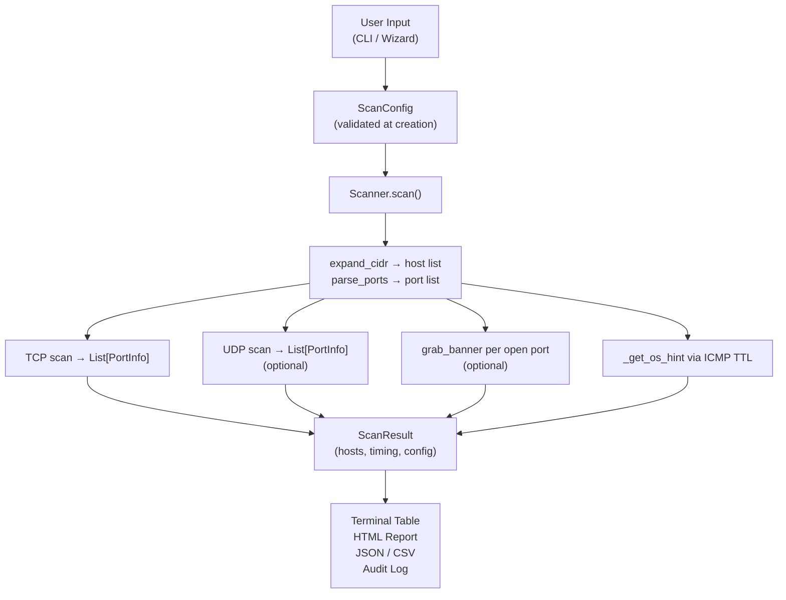

<div align="center">

```
 ██╗   ██╗███████╗██╗██╗     ███████╗ ██████╗ █████╗ ███╗   ██╗
 ██║   ██║██╔════╝██║██║     ██╔════╝██╔════╝██╔══██╗████╗  ██║
 ██║   ██║█████╗  ██║██║     ███████╗██║     ███████║██╔██╗ ██║
 ╚██╗ ██╔╝██╔══╝  ██║██║     ╚════██║██║     ██╔══██║██║╚██╗██║
  ╚████╔╝ ███████╗██║███████╗███████║╚██████╗██║  ██║██║ ╚████║
   ╚═══╝  ╚══════╝╚═╝╚══════╝╚══════╝ ╚═════╝╚═╝  ╚═╝╚═╝  ╚═══╝
```


<br/>


**Professional Network Intelligence Suite — For authorized use only**

[Features](#-features) · [Installation](#-installation) · [Usage](#-usage) · [Scan Profiles](#-scan-profiles) · [Reports](#-reports) · [Architecture](#-architecture) · [Author](#-author)

</div>

---

## 🔍 What is VeilScan?

**VeilScan** is a custom-built, multi-threaded network security audit tool written in pure Python. It does everything a basic port scanner does — and then explains *why each finding matters*.

### The Problem with Existing Tools

| Tool | Problem |
|---|---|
| **Nmap** | Powerful but cryptic — raw port numbers, zero explanation |
| **Online scanners** | Cloud-dependent, feature-limited, no local lab support |
| **Metasploit** | Exploitation focus — too advanced for audits and education |

**VeilScan solves this.** Scan a target, get a full terminal table, and open a professional HTML report that explains every open port in plain English — risk-rated and color-coded.

```
Port 3306 open? → MySQL exposed on network → CRITICAL
                → "A database should NEVER be directly reachable from outside the server."
                → "What to check: Bind to 127.0.0.1 only. Verify no external connections."
```

> [!IMPORTANT]
> VeilScan is developed strictly for **authorized security testing, education, and home lab use**. Only scan systems you own or have explicit written permission to test.

---

## ✨ Features

<div align="center">

| Feature | Detail |
|---|---|
| ⚡ **TCP Scanning** | Thread-pool engine, race-condition-free, 1–1000 configurable threads |
| 📡 **UDP Scanning** | 11 service-specific probes, ICMP Port Unreachable detection |
| 🔍 **Banner Grabbing** | 15+ protocol parsers — SSH, HTTP/S, FTP, MySQL, Redis, VNC, IRC and more |
| 🖥️ **OS Fingerprinting** | TTL-based detection from actual ICMP response (not local default) |
| 🧠 **Vulnerability Hints** | 42-entry plain-English risk database — all Metasploitable ports covered |
| 📊 **HTML Reports** | Standalone browser report — risk cards, color-coded severity, print-ready |
| 📁 **Multi-Format Output** | HTML + JSON + CSV + TXT — all saved simultaneously |
| 🧙 **Interactive Wizard** | Step-by-step guided scan — no CLI knowledge required |
| 🌐 **CIDR Subnet Scanning** | Scan entire subnets — `192.168.1.0/24` → 254 hosts |
| 🔒 **Zero Dependencies** | Pure Python stdlib — no pip install required to run |

</div>

---

## 📦 Installation

### Clone and Run (No Install Required)

```bash
git clone https://github.com/AqibTayyab/veilscan.git
cd veilscan
python main.py
```

### Install via pip (Global Command)

```bash
pip install .
veilscan
```

### Optional — Windows Color Support

```bash
pip install colorama
```

> [!NOTE]
> **Requirements:** Python 3.10+ only. VeilScan checks your Python version at startup and gives a clear error if it's below 3.10. Zero mandatory dependencies — the core scanner runs entirely on Python's standard library.

---

## 🚀 Usage

### Interactive Wizard (Recommended for Beginners)

```bash
python main.py
```

No arguments = interactive wizard launches. Step-by-step: target → scan type → UDP → reports.

---

### Command Line — Scan Profiles

```bash
# Quick scan — Top 100 ports, 200 threads, 0.5s timeout
python main.py 192.168.1.1 --profile quick --agree

# Standard scan — Top 1000 ports, balanced
python main.py 192.168.1.1 --profile standard --agree

# Full scan — All 65535 ports (20–40 minutes)
python main.py 192.168.1.1 --profile full --agree

# Stealth scan — Quiet, minimal traffic, 10 threads
python main.py 192.168.1.1 --profile stealth --agree
```

---

### Specific Ports and Ranges

```bash
# Specific ports
python main.py 192.168.1.1 -p 22,80,443,3306,8080 --agree

# Port range
python main.py 192.168.1.1 -p 1-1024 --agree

# Mixed range and list
python main.py 192.168.1.1 -p 22,80-90,443,8000-8100 --agree
```

---

### Subnet Scanning

```bash
# Scan entire /24 subnet (254 hosts)
python main.py 192.168.1.0/24 -p top100 --agree

# With auto-report (saves HTML + JSON + CSV)
python main.py 192.168.1.0/24 --profile quick --agree --auto-report
```

---

### UDP Scanning

```bash
# TCP + UDP (requires admin on Windows)
python main.py 192.168.1.1 --udp --agree

# Linux — accurate ICMP detection (requires root)
sudo python3 main.py 192.168.1.1 --udp --agree
```

---

### Output Formats

```bash
# Auto-save all formats (recommended)
python main.py 192.168.1.1 --agree --auto-report

# Save specific format
python main.py 192.168.1.1 --agree -o scan.json
python main.py 192.168.1.1 --agree -o scan.csv -f csv
```

---

### Python API

```python
from veilscan.config import ScanConfig
from veilscan.scanner import Scanner
from veilscan.reporter import Reporter
from veilscan.html_reporter import generate_html

config = ScanConfig(
    target  = "192.168.1.1",
    ports   = "top100",
    threads = 200,
    timeout = 0.5,
    banners = True,
    profile = "quick",
)

result = Scanner(config).scan()
Reporter(result).print_table()

# Save HTML report
with open("report.html", "w") as f:
    f.write(generate_html(result))

# Access results programmatically
for host in result.hosts:
    for port in host.open_ports:
        print(f"{port.port}/{port.protocol} {port.service} {port.version}")
```

---

## 🎯 Scan Profiles

| Profile | Ports | Threads | Timeout | Use Case |
|---|---|---|---|---|
| `quick` | Top 100 | 200 | 0.5s | First look at a target |
| `standard` | Top 1000 | 100 | 1.0s | General security audit |
| `full` | All 65535 | 50 | 2.0s | Complete thorough audit |
| `stealth` | Top 100 | 10 | 3.0s | Quiet, minimal traffic |

---

## 📊 Reports

### Terminal Output

```
╔══════════════════════════════════════════════════════════╗
║  Host: 192.168.140.130 (192.168.140.130)                 ║
║  OS Hint: Linux/Unix (TTL=64)                            ║
╚══════════════════════════════════════════════════════════╝
PORT    PROTO   STATE    SERVICE    VERSION
────────────────────────────────────────────────────────────
22      tcp     OPEN     SSH        OpenSSH_4.7p1
80      tcp     OPEN     HTTP       Apache/2.2.8 (Ubuntu)
3306    tcp     OPEN     MySQL      5.0.51a-3ubuntu5
445     tcp     OPEN     SMB        Samba smbd 3.X

Scan complete: 1 host(s) | 16 open port(s) | 25.78s
```

**Port states:**
- 🟢 `OPEN` — connection accepted, service confirmed running
- 🟡 `OPEN|FILTERED` — no response (UDP), firewall or open
- ⚫ `CLOSED` — connection refused, nothing listening

---

### HTML Report — Risk Cards

The standalone HTML report opens in any browser with no server required.

**Risk levels — sorted CRITICAL first:**

| Badge | Level | Meaning | Action |
|---|---|---|---|
| 🚫 CRITICAL | `#c0392b` | Immediate threat — exploit-ready | Fix now |
| ⚠️ HIGH | `#d35400` | Significant risk | Fix this week |
| ⚠️ MEDIUM | `#d4ac0d` | Requires investigation | Fix this month |
| ✓ LOW | `#1e8449` | Minor concern | Review when possible |
| ℹ️ INFO | `#1a7abf` | Informational only | Monitor |

Each finding card contains:
- **What it is** — plain English description of the service
- **Why it matters** — the actual security risk
- **What to check** — specific actionable steps
- **💡 Tip** — one key takeaway

---

### Output Files

```
reports/scan_192_168_1_1_20260808_033709.html   ← Open in browser
reports/scan_192_168_1_1_20260808_033709.json   ← Machine-readable / SIEM
reports/scan_192_168_1_1_20260808_033709.csv    ← Excel / Google Sheets
logs/scan_history.log                            ← Audit trail
```

> [!NOTE]
> All report files are in `.gitignore` — you cannot accidentally commit scan results to a public repository.

---

## 🏗️ Architecture

### File Structure

```
veilscan/
├── main.py                   ← Root entry point
├── pyproject.toml            ← pip packaging + entry points
├── requirements.txt          ← Optional: colorama
├── reports/                  ← Auto-saved reports (HTML/JSON/CSV)
├── logs/                     ← Audit trail (scan_history.log)
└── veilscan/                 ← Main Python package
    ├── config.py             ← ScanConfig dataclass + 4 scan profiles
    ├── models.py             ← PortState, PortInfo, HostResult, ScanResult
    ├── utils.py              ← Port map, CIDR, OS hint, validation
    ├── tcp_scanner.py        ← TCP thread-pool engine
    ├── udp_scanner.py        ← UDP engine with ICMP detection
    ├── banner_grabber.py     ← Service fingerprinting (15+ protocols)
    ├── scanner.py            ← Orchestrator — wires all modules
    ├── reporter.py           ← CLI table + JSON/CSV/TXT output
    ├── html_reporter.py      ← HTML report generator
    ├── vuln_hints.py         ← 42-entry risk explanation database
    └── cli.py                ← Full CLI + interactive wizard

tests/                        ← 368 tests, all modules covered
```

---

### Technology Stack

| Layer | Technology | Why |
|---|---|---|
| Language | Python 3.10+ | Modern type hints, stdlib only |
| Networking | `socket` (stdlib) | Full TCP/UDP/ICMP control, zero deps |
| TLS | `ssl` (stdlib) | HTTPS banner grabbing without external libs |
| Threading | `threading` + `queue` | Thread-pool scanning, race-condition-free |
| CLI | `argparse` (stdlib) | No click/typer dependency |
| HTML Output | f-strings + `html.escape` | No Jinja2 needed, XSS-safe |
| Tests | `pytest` + `unittest.mock` | Industry standard, fully offline |
| Packaging | `setuptools` + `pyproject.toml` | Modern pip-compatible |

---

### Data Flow



---

### Threading Model

```
Main thread
  └── scan_tcp_batch()
        ├── queue = [22, 80, 443, 3306, ...]   (all ports pre-loaded)
        ├── Thread 1: get_nowait() → scan_port() → lock → results.append()
        ├── Thread 2: get_nowait() → scan_port() → lock → results.append()
        ...
        ├── Thread N: get_nowait() → scan_port() → lock → results.append()
        └── queue.join() ← blocks until every port has task_done() called
```

**Thread safety mechanisms:**
- `queue.Queue` — atomic port distribution (`get_nowait()` is one atomic operation)
- `threading.Lock` — protects `results` list from concurrent appends
- `threading.Event` — `stop_event` for clean Ctrl+C abort
- `task_done()` in `finally` — queue never deadlocks even if worker crashes

---

## 🔐 Security Design

| Concern | Solution |
|---|---|
| **XSS in HTML report** | All network-derived content through `html.escape(quote=True)` |
| **Memory exhaustion** | Banner reads capped at 4KB, stored as 256 chars max |
| **Unauthorized scanning** | Consent prompt for all non-private-IP targets |
| **Credential exposure** | VeilScan never logs credentials — audit log records target + port count only |
| **Code execution via banner** | Never `eval()`, `exec()`, or `pickle.loads()` any network data |
| **Report data leaks** | `reports/` and `logs/` in `.gitignore` — no accidental commits |

---

## 🧪 Test Suite

```
tests/
├── test_models.py           38 tests  — PortState, PortInfo, HostResult
├── test_utils.py            50 tests  — parse_ports, expand_cidr, validate_target
├── test_config.py           30 tests  — ScanConfig, profiles, validation
├── test_tcp_scanner.py      21 tests  — TCP engine, race conditions, abort
├── test_udp_scanner.py      26 tests  — UDP engine, ICMP, service probes
├── test_banner_grabber.py   44 tests  — 15+ protocol parsers, TLS, VNC, IRC
├── test_scanner.py          30 tests  — full pipeline, CIDR, OS hint
├── test_html_reporter.py    42 tests  — HTML structure, XSS escaping, fallback cards
└── test_vuln_hints.py       47 tests  — all 42 hints, risk levels, Metasploitable coverage
                         ─────────────
                         368 tests total — all mocked (zero real network connections)
```

```bash
pip install pytest
pytest tests/ -v
```

---

## ✅ Verified Real Scan Results

### Metasploitable 2 — Quick Profile

```
16 open ports found in 25.78s

8 CRITICAL: Telnet(23), SMB(445), rexec(512), rlogin(513),
            rsh(514), Java-RMI(1099), MySQL(3306), PostgreSQL(5432)
4 HIGH:     RPCbind(111), NetBIOS(139), NFS(2049), VNC(5900)
4 MEDIUM:   SMTP(25), DNS(53), HTTP(80), IRC(6667)
```

### Metasploitable 2 — Standard Profile

```
19 open ports found in 50.82s
Additional: FTP/vsFTPd 2.3.4 (21), SSH/OpenSSH_4.7p1 (22), X11 (6000)
```

### scanme.nmap.org — Quick Profile

```
2 open ports in 3.20s
22/tcp  SSH   OpenSSH_6.6.1p1
80/tcp  HTTP  Apache/2.4.7 (Ubuntu)
```

---

## 🗺️ Roadmap

| Version | Feature | Status |
|---|---|---|
| v2.0.0 | Full scanner, 42 hints, 368 tests, pip install | ✅ Released |
| v2.1 | CVE version lookup via NVD API | 🔄 Planned |
| v2.1 | Multi-target file input (`-f targets.txt`) | 🔄 Planned |
| v2.1 | Scan comparison (diff two JSON results) | 🔄 Planned |
| v2.1 | IPv6 support | 🔄 Planned |
| Future | PyPI — `pip install veilscan` | 🔄 Planned |

---

## 🔗 Additional Resources

- 📺 **Watch the Build:** [VeilScan — Building a Security Tool from Scratch in Urdu/Hindi](https://www.youtube.com/@MuhammadAqibTayyab)
- 🌐 **Series:** [Security Engineer Roadmap 2026](https://github.com/AqibTayyab/Security-Engineer-Roadmap-2026)
- 💼 **Connect:** [LinkedIn: Muhammad Aqib Tayyab](https://www.linkedin.com/in/muhammad-aqib-tayyab-ethical-hacker/)

---

## 🙋‍♂️ Author

<div align="center">

**Muhammad Aqib Tayyab** — AppSec & Purple Team Student | Certified Ethical Hacker | Bug Bounty Hunter

BS-IT Student at NUML, Pakistan — building real security tools and documenting everything in public.

[](https://www.linkedin.com/in/muhammad-aqib-tayyab-ethical-hacker/)
[](https://www.youtube.com/@MuhammadAqibTayyab)
[](https://github.com/AqibTayyab)

---


</div>

---

`#Python` `#NetworkSecurity` `#PortScanner` `#AppSec` `#PurpleTeam` `#EthicalHacking` `#SecurityTools` `#CTF` `#LearningInPublic` `#Pakistan` `#NUML`
